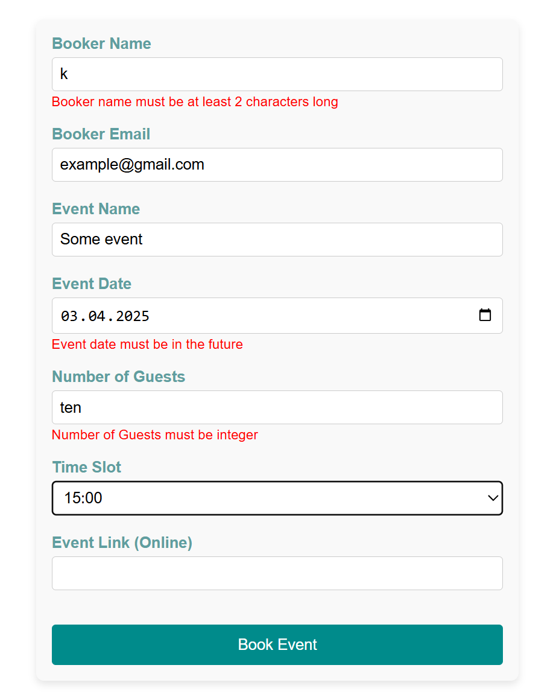

# Form validation with Zod and React Hook Form

The **BookingForm** component has been created for an event booking system. The form captures booking details and validates the inputs using a **Zod** schema integrated with **React Hook Form**. The validation ensures the data is in the correct format (like email or URL) and matches available time slots provided by the API. Custom error messages are displayed using the **ErrorMessage component**.

